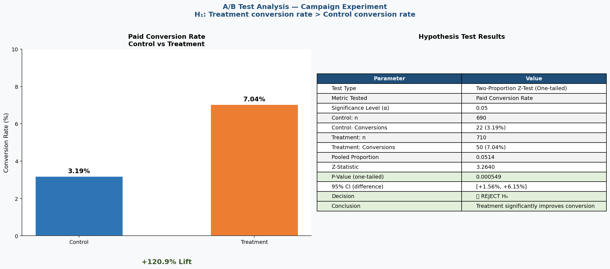

# Campaign Experiment Analysis — A/B Test Report

## 1. Business Context
A subscription-based digital product company launched a new onboarding and activation campaign. Users were split into:
- **Control group**: Existing onboarding experience
- **Treatment group**: New campaign experience

Leadership wants to know: **Should the treatment be launched to all users?**

The decision impacts Product, Growth, and Customer Success teams. Evidence required: statistically significant improvement in paid conversion rate with no harmful degradation in guardrail metrics.

---

## 2. Dataset Description
- **File**: `data/campaign_experiment_data.xlsx`
- **Rows**: 1,408 (1,400 after dedup) | **Columns**: 16
- **Groups**: Control (690), Treatment (710)
- **Key fields**: `user_id`, `experiment_group`, `region`, `device_type`, `traffic_source`, `plan_type`, `visited_landing_page`, `started_trial`, `completed_onboarding`, `converted_to_paid`, `revenue_30d`, `support_tickets_30d`, `refund_requested`, `days_to_convert`, `engagement_score`

**Data quality issues found:**
| Issue | Count | Action |
|-------|-------|--------|
| Duplicate user_ids | 8 | Removed (kept first) |
| Missing device_type | 18 | Filled "Unknown" |
| Missing traffic_source | 24 | Filled "Unknown" |
| Missing engagement_score | 14 | Filled with group median |
| Revenue outliers (>₹1496) | 14 | Flagged, retained |
| days_to_convert nulls | 1,336 | Expected — null for non-converters |

---

## 3. North Star Metric Selected
**Paid Conversion Rate** = Converted users / Total users

This is the primary success metric because:
- It directly measures campaign effectiveness in driving revenue
- It captures the full funnel outcome from awareness to payment
- All other metrics (trial rate, engagement, ARPU) are either upstream inputs or downstream effects

**Risk of blind optimization:** Conversion could be inflated by dark patterns or aggressive prompts, leading to high refunds and churn — which is exactly what the guardrail metrics are designed to catch.

---

## 4. KPI Tree Summary
The North Star (Paid Conversion Rate) is driven by three primary KPI pillars:

1. **Activation Funnel**: Landing page visit rate → Trial start rate → Onboarding completion rate
2. **Engagement Quality**: Engagement score, days to convert, feature adoption
3. **Revenue Outcome**: ARPU, revenue per converted user, plan type mix

**Guardrail metrics**: Refund rate, Support ticket rate, Segment-level conversion decline

See full KPI tree: `outputs/kpi_tree.png`

---

## 5. Experiment Analysis Approach
- Cleaned dataset saved to `analysis/experiment_analysis.xlsx`
- Metrics calculated per group for 11 KPIs overall + 3 segment breakdowns (region, device, plan type)
- Results saved to `outputs/experiment_summary.xlsx` with 4 sheets

---

## 6. Hypothesis Test Summary
- **Test**: Two-proportion Z-test (one-tailed)
- **Metric**: Paid Conversion Rate
- **H₀**: p_treatment ≤ p_control | **H₁**: p_treatment > p_control
- **α**: 0.05

| Result | Value |
|--------|-------|
| Z-statistic | 3.264 |
| P-value | 0.000549 |
| 95% CI (difference) | [+1.56%, +6.15%] |
| Decision | **Reject H₀** — significant improvement confirmed |

Full notes: `analysis/hypothesis_test_notes.md`

---

## 7. Guardrail Metrics Considered

| Guardrail | Control | Treatment | Risk Level |
|-----------|---------|-----------|------------|
| Support Ticket Rate | 22.0% | 37.3% (+69.4%) | 🔴 HIGH |
| Refund Rate | 0.00% | 0.42% | 🟡 MONITOR |
| Engagement Score | 57.03 | 62.94 (+10.4%) | 🟢 POSITIVE |

**The support ticket spike is the primary blocker for a full launch.**

---

## 8. Final Recommendation
🟡 **PHASED LAUNCH — Do not launch to all users immediately**

1. Launch Treatment to Desktop + Premium plan users in North/East regions first
2. Investigate and fix the root cause of the support ticket spike
3. Re-run experiment with improved experience before full rollout

---

## 9. Assumptions and Limitations
- First occurrence kept for 8 duplicate user_ids
- days_to_convert null = user has not converted (not a data error)
- Revenue outliers retained (not removed) as they may represent genuine high-value users
- Experiment temporal effects not controlled — different signup dates across groups
- 72 total converters is a small sample for secondary metric analysis (ARPU, days_to_convert)

---

## 10. Screenshots Included

### KPI Tree

### Hypothesis Test Output

